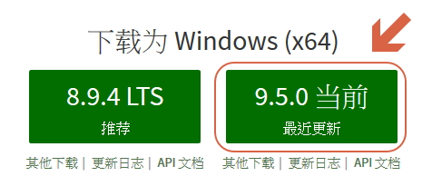

# novel-txt-merge

> 合併小說個別 txt 章節/目錄 => 單一 txt 合併

`npx novel-txt-merge`

## use

直接執行 `npx novel-txt-merge` 這個命令

不懂的話按照以下步驟

### 使用條件

* 安裝 [Node.js](https://nodejs.org/zh-cn/)

* 下載 [此檔案](file/txt-go.bat) 放置到 小說 txt 資料夾 然後點擊

將檔名改成 xxx.bat (xxx 的部分隨你喜歡)

* __接著就自動將txt合併了 不需要額外操作__
